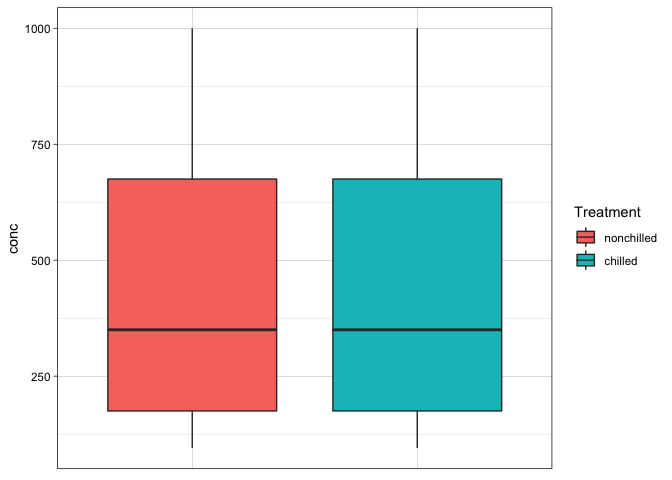
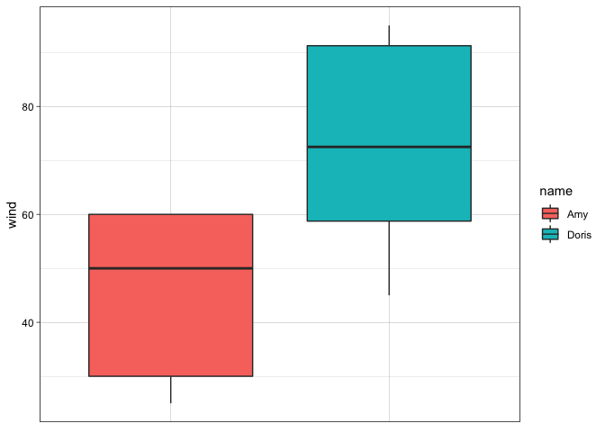
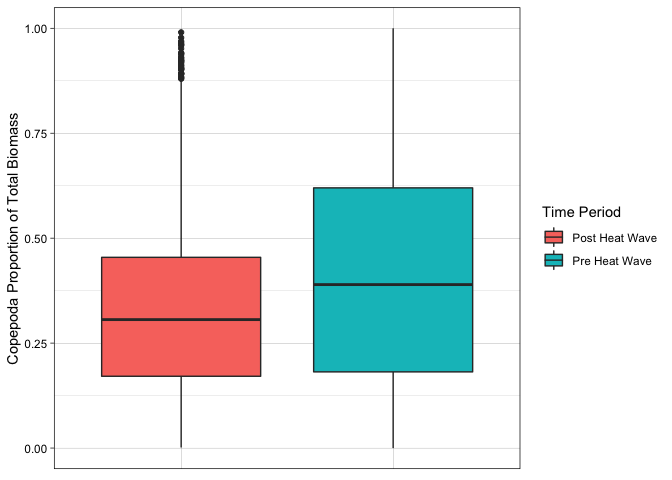

STAT545 Assignment B1
================
Julia Fast
01/11/2021

*Note that some code and text below will overlap with code and text from
the STAT545A Mini Data Analysis (MDA).*

## Datset Background

*(Section Copied from STAT545A MDA Project)*

The *zooplankton_biomass* dataset used for this assignment was acquired
courtesy of Fisheries and Oceans Canada (DFO). I will be using this
dataset for my MSc research project. It contains zooplankton biomass
data by major taxa collected from 1980 to 2018 at a variety of stations
in the NE Pacific and Canadian Arctic oceanic regions. Samples were
collected both during the day and at night using a variety of sampling
net types (Government of Canada \[date unknown\]).

## Install and Load Packages

**Install** the `tidyverse`, `readr`, `roxygen2`, and `testthat`
packages if you have not already done so:

``` r
#install the tidyverse package:
#install.packages("tidyverse")

#install the readr package:
#install.packages("readr")

#install the roxygen2 package:
#install.packages("roxygen2")

#install the testthat package:
#install.packages("testthat")
```

**Load** the `tidyverse`, `testthat`, and `roxygen2` packages, as well
as the `zooplankton dataset` being used for this project:

``` r
#load the readr package (this package will allow the CSV file containing the project dataset to be read)
library(readr) 
#load the tidyverse package
library(tidyverse)
#load the testthat package
library(testthat)
#load the roxygen2 package
library(roxygen2)

#read the project dataset in RStudio, and save this dataset as a variable called "zooplankton_biomass"
#the CSV file containing the project dataset is located in the AssignmentB1 folder of the project GitHub repository
zooplankton_biomass <- read_csv('IOS_zooplankton_1980_2018_as_biomass_major_taxa_groups_EN.csv')
```

For this assignment, I’d like to use the function I will create to
answer questions pertaining to the zooplankton_biomass dataset from DFO.
I will use a cleaned up version of the zooplankton_biomass dataset that
I created for the Mini Data Analysis Milestone 3 assignment from the
STAT545A class (below code from STAT545A MDA Milestones 2-3).

``` r
#create a subset of the zooplankton_biomass dataset called "zooplankton_biomass_cleaned"
zooplankton_biomass_cleaned <- zooplankton_biomass %>% 
  #remove the columns from 'Station' to 'latitude' and from 'time' to 'CTD' from the dataset
  select(-c(Station:latitude, time:CTD)) %>% 
  #separate the date column into three columns of year, month, and day
  #the below line of code is from joels 2018
  separate(date, sep="-", into = c("year", "month", "day")) %>% 
  #remove newly created month and day columns from the dataset
  select(-c(month, day)) %>% 
  #create a new variable called "time_period" that groups each year as either pre or post marine heat wave
  mutate(time_period = case_when(year < 2014 ~ "Pre Heat Wave",
                                TRUE ~ "Post Heat Wave")) %>% 
  #arrange region_name to be in alphabetical order and year to be in ascending order
  arrange(across(region_name:year)) %>% 
  #arrange the columns so that the time_period column comes after the year column
  select(c(region_name, year, time_period, everything()))

#view the cleaned up dataset
print(zooplankton_biomass_cleaned)
```

    ## # A tibble: 11,621 × 38
    ##    region_name       year  time_period Polychaeta Amphipoda Cirripedia Cladocera
    ##    <chr>             <chr> <chr>            <dbl>     <dbl>      <dbl>     <dbl>
    ##  1 Alaska Basin East 1980  Pre Heat W…     1.32       0.123          0         0
    ##  2 Alaska Basin East 1980  Pre Heat W…     0.0233     0.513          0         0
    ##  3 Alaska Basin East 1980  Pre Heat W…     0          0              0         0
    ##  4 Alaska Basin East 1980  Pre Heat W…     0          0              0         0
    ##  5 Alaska Basin East 1980  Pre Heat W…     0.120      0              0         0
    ##  6 Alaska Basin East 1980  Pre Heat W…     0          0              0         0
    ##  7 Alaska Basin East 1980  Pre Heat W…     0          0              0         0
    ##  8 Alaska Basin East 1980  Pre Heat W…     0.120      0              0         0
    ##  9 Alaska Basin East 1980  Pre Heat W…     0          0.205          0         0
    ## 10 Alaska Basin East 1980  Pre Heat W…     0.120      0.421          0         0
    ## # … with 11,611 more rows, and 31 more variables: Copepoda <dbl>,
    ## #   Cumacea <dbl>, Anomura <dbl>, Brachyura <dbl>, Caridea <dbl>,
    ## #   Pleocyemata <dbl>, Euphausiacea <dbl>, Isopoda <dbl>, Mysida <dbl>,
    ## #   Ostracoda <dbl>, Bryozoa <dbl>, Chaetognatha <dbl>, Anthozoa <dbl>,
    ## #   Hydromedusa <dbl>, Siphonophora <dbl>, Scyphozoa <dbl>, Ctenophora <dbl>,
    ## #   Echinodermata <dbl>, Bivalva <dbl>, Cephalopoda <dbl>, Gastropoda <dbl>,
    ## #   Pteropoda <dbl>, Nemertea <dbl>, Phoronida <dbl>, Pisces <dbl>, …

I want to further modify this cleaned dataset to work best with the
function I plan to create (code modified from STAT545A MDA Milestone 3):

``` r
#create a new dataset called "zooplankton_funct" from the cleaned version of the original dataset
zooplankton_funct <- zooplankton_biomass_cleaned %>% 
  #create a new column (variable) called "total_biomass" that sums all zooplankton taxa biomass values in each row
  mutate("total_biomass" = rowSums(across(where(is.numeric)))) %>%
  #divide the zooplankton biomass values by the total biomass in that sample so that these cells contain the proportion of total biomass the zooplankton taxa makes up in each sample
  #below line of code adapted from Cetinkaya-Rundel et al. 2020
  mutate(across(where(is.numeric), ~./total_biomass)) %>% 
  #remove the total biomass column
  select(-total_biomass) %>% 
  #rename the time_period column "Time Period"
  rename("Time Period" = time_period) %>% 
  #rename each zooplankton taxa column as the taxa name followed by "Proportion of Total Biomass"
  #below line of code adapted from akrun 2020 
  rename_with(~str_c(., " Proportion of Total Biomass"), Polychaeta:Animalia)
  
#view the new dataset
print(zooplankton_funct)
```

    ## # A tibble: 11,621 × 38
    ##    region_name       year  `Time Period` `Polychaeta Proport… `Amphipoda Propor…
    ##    <chr>             <chr> <chr>                        <dbl>              <dbl>
    ##  1 Alaska Basin East 1980  Pre Heat Wave             0.0161              0.00150
    ##  2 Alaska Basin East 1980  Pre Heat Wave             0.000787            0.0174 
    ##  3 Alaska Basin East 1980  Pre Heat Wave             0                   0      
    ##  4 Alaska Basin East 1980  Pre Heat Wave             0                   0      
    ##  5 Alaska Basin East 1980  Pre Heat Wave             0.00580             0      
    ##  6 Alaska Basin East 1980  Pre Heat Wave             0                   0      
    ##  7 Alaska Basin East 1980  Pre Heat Wave             0                   0      
    ##  8 Alaska Basin East 1980  Pre Heat Wave             0.00337             0      
    ##  9 Alaska Basin East 1980  Pre Heat Wave             0                   0.00720
    ## 10 Alaska Basin East 1980  Pre Heat Wave             0.00519             0.0183 
    ## # … with 11,611 more rows, and 33 more variables:
    ## #   Cirripedia Proportion of Total Biomass <dbl>,
    ## #   Cladocera Proportion of Total Biomass <dbl>,
    ## #   Copepoda Proportion of Total Biomass <dbl>,
    ## #   Cumacea Proportion of Total Biomass <dbl>,
    ## #   Anomura Proportion of Total Biomass <dbl>,
    ## #   Brachyura Proportion of Total Biomass <dbl>, …

# Exercises 1-2: Make a Function and Document the Function

I want to create a function that will allow me to compare the proportion
of total biomass made up by one of the zooplankton taxa pre and post
heat wave. I will make this function general so that it can be used to
compare any numeric variable across each category of any categorical
variable. This function will be called “boxplot_numeric_category”.

``` r
#' @title Multiple Boxplot for a Numeric Variable across Categories 
#' @description This function creates a multiple boxplot that shows the distribution of a numeric variable in each different category contained in a categorical variable. This function will remove any NA values in the data prior to creation of the boxplot.
#' @params dataframe The dataframe that contains the variables that you would like to use to create the boxplot. The class of this parameter must be dataframe. This argument was named dataframe because the variable that needs to be input here must have a dataframe class type, so users will instantly know what type of variable to include for this argument.
#' @params x The categorical variable containing the categories that we want to plot the distribution of a numeric variable across. x must be a vector of class character or factor. This parameter was named x because it is the variable that is plotted on the x axis, and most users would be used to "x" being used to represent the x axis variable, so this argument name would be familiar to users.
#' @params y The numeric variable that we want to examine the distribution of across a categorical variable. y must be a vector of class double, integer, or numeric. This parameter was named y because it is the variable that is plotted on the y axis, and most users would be used to "y" being used to represent the y axis variable, so this argument name would be familiar to users.
#' @return A single panel multiple boxplot showing the distribution of the variable y in each category contained in the variable x.

boxplot_numeric_category <- function (dataframe, x, y) {
  
classinfo_x <- summarise(dataframe, is.character = is.character({{ x }}) | is.factor({{ x }}), class = class({{ x }}))

classinfo_y <- summarise(dataframe, is.numeric = is.numeric({{ y }}) | is.double({{ y }}) | is.integer({{ y }}), class = class({{ y }}))
  
  
  if(!is.data.frame(dataframe)) {
    stop('You have entered an input that is not a dataframe. Please use a dataframe for the dataframe input. Class type of the variable you entered is: ', class(dataframe))
    }

  if(!classinfo_x$is.character) {
    stop('You have entered a non-character or non-factor input. Please enter a character or factor variable for the x input. Class type of the variable you entered is: ', class(classinfo_x$class))
  }
  
  if(!classinfo_y$is.numeric) {
    stop('You have entered a non-numeric, non-integer, or non-double input. Please enter a variable of a numeric, integer, or double class for the y input. Class type of the variable you entered is: ', class(classinfo_y$class))
  }
  

  dataframe %>% 
    #below line of code from Leon 2020
    drop_na({{ x }}, {{ y }}) %>% 
    ggplot(aes({{ x }}, {{ y }})) +
    geom_boxplot(aes(fill= {{ x }})) + 
    theme_linedraw() +
    #below line of code from Elferts 2016
    theme(axis.text.x=element_blank(),
          axis.ticks.x=element_blank(),
          axis.title.x=element_blank())
}
```

# Exercise 3: Include Examples

I will be using some of the datasets contained in the r `datasets` and
`dplyr` packages.

We have already installed and loaded the `tidyverse` package, which
contains `dplyr`. Install and load the `datasets` package if you have
not done so already.

``` r
#install the "datasets" package
#install.packages("datasets")

#load the datasets package
library(datasets)
```

First, let’s look at a few examples of how the boxplot_numeric_category
function works:

### Example 1

``` r
#using the "CO2" dataset from the r "datasets" package,
#create a boxplot that shows the distribution of CO2 concentration of grass plants in each treatment type (chilled or nonchilled)
boxplot_numeric_category(dataframe = CO2, x = Treatment, y = conc)
```

<!-- -->

As we can see, the boxplot_numeric_category function we created works
here. The variables that we input into the function are a dataframe
(CO2) as the dataframe argument, a categorical variable (Treatment) as
the x argument, and a numeric variable (conc) as the y argument. I have
shown the classes of these variables below to illustrate this.

``` r
#see that the class of the CO2 variable is a dataframe
class(CO2)
```

    ## [1] "nfnGroupedData" "nfGroupedData"  "groupedData"    "data.frame"

``` r
#see that the Treatment variable is a categorical variable with a factor class
class(CO2$Treatment)
```

    ## [1] "factor"

``` r
#see that the conc variable is a numeric variable with a numeric class
class(CO2$conc)
```

    ## [1] "numeric"

These variables fit the parameter requirements of the function, so the
function works.

### Example 2

``` r
#using the "starwars" dataset from the dplyr package,
#create a boxplot that shows the distribution of the height of starwars characters based on the sex of the characters
starwars %>% boxplot_numeric_category(sex, height)
```

<!-- -->

The above example shows the use of the boxplot_numeric_category with
piping to keep the code orgnaized. Once again, the variable inputted as
the dataframe argument (starwars) is a dataframe, the variable inputted
as the x argument (sex) is a categorical variable and the variable
inputted as the y argument (height) is a numeric variable (specifically
an integer class), so the function works.

### Example 3

``` r
#using the "storms" dataset from the dplyr package,
#create a boxplot that shows the distribution of the wind speeds observed for each of the storms Caroline and Doris
boxplot_numeric_category((storms %>% filter(name == c("Amy", "Doris"))), name, wind)
```

<!-- -->

The above example shows the use of a dplyr function (filter) nested
within the dataframe parameter of the boxplot_numeric_category function.
Because the filtered dataset created here is still a dataframe class,
and the x and y arguments inputted (name and wind) are categorical and
numeric (specifically integer) variables respectively, the function
works.

Now let’s see an example where the function does not run.

### Example 4

``` r
#we will create a line of code using the boxplot_numeric_category function that will return an error message
#using the "starwars" dataset from the dplyr package,
#create a boxplot that shows the distribution of the name of starwars characters based on the sex of the characters

boxplot_numeric_category(starwars, sex, name)
```

    ## Error in boxplot_numeric_category(starwars, sex, name): You have entered a non-numeric, non-integer, or non-double input. Please enter a variable of a numeric, integer, or double class for the y input. Class type of the variable you entered is: character

As we can see, we get an error message when trying to run the above
code. This is because the y argument inputted (name) is a character and
not a numeric vector, so based on our function parameters, the function
will deliver an error message.

### Example with Zooplankton Biomass Data

Finally, let’s use the boxplot_numeric_category function to create a
boxplot that compares the proportion of Copepoda (one zooplankton taxa)
in total zooplankton biomass pre and post the recent 2014 marine heat
wave, as this was something I was interested in from the STAT545A MDA
Milestones.

``` r
#create a boxplot that compares the proportion of Copepods in total biomass pre and post heat wave
#save this boxplot as a new variable called "boxplot_cop_biomass"
boxplot_cop_biomass <- boxplot_numeric_category(zooplankton_funct, `Time Period`, `Copepoda Proportion of Total Biomass`)

#view the results of this operation
print(boxplot_cop_biomass)
```

<!-- -->

Again we have entered a dataframe class variable (zooplankton_funct) as
the dataframe argument, a categorical variable (Time Period) as the x
argument and a numeric variable (Copepoda Proportion of Total Biomass)
as the y argument. Because the variables entered fit the parameters for
their respective arguments (as specified in the boxplot_numeric_category
function code), the function works.

Based on the above examples, the function appears to be working, but
let’s run some tests to be sure!

# Exercise 4: Test the Function

First, let’s test to see if Examples 1-3 above, which have the correct
variable types as inputs, run without an error message. Let’s also test
to see if Example 4, which did not have all correct variable class types
as inputs, gave the error message specified in the
boxplot_numeric_category function code:

``` r
test_that("Testing if Examples for Boxplot Function Work or Do Not Work as Expected", {
  #test to see if examples 1 and 2 (above) run without an error message
  expect_silent(boxplot_numeric_category(dataframe = CO2, x = Treatment, y = conc))
  expect_silent(starwars %>% boxplot_numeric_category(sex, height))
  #test to see if example 3 (above) runs without an error message
  expect_silent(boxplot_numeric_category((storms %>% filter(name == c("Amy", "Doris"))), name, wind))
   #test to see if example 4 (above) runs with the correct error message specified in the boxplot_numeric_category function code
  expect_error(boxplot_numeric_category(starwars, sex, name), "You have entered a non-numeric, non-integer, or non-double input. Please enter a variable of a numeric, integer, or double class for the y input. Class type of the variable you entered is: ")
})
```

    ## Test passed 🥇

As we can see, the function is working (giving error messages only when
it should and running smoothly when it should) based on these tests
because the tests passed!

Now let’s test now to see if each of Examples 1-3 and the example with
zooplankton biomass data, which all use the correct variable class types
in the boxplot function, output a ggplot:

``` r
test_that("Output Class Type of Boxplot Function Examples is ggplot", {
  #test to see if examples 1-3 and the example with zooplankton biomass data (above) produce a ggplot output as expected
  expect_s3_class((boxplot_numeric_category(dataframe = CO2, x = Treatment, y = conc)), "ggplot")
  expect_s3_class((starwars %>% boxplot_numeric_category(sex, height)), "ggplot")
  expect_s3_class((boxplot_numeric_category((storms %>% filter(name == c("Amy", "Doris"))), name, wind)), "ggplot")
  expect_s3_class(boxplot_cop_biomass, "ggplot")
  })
```

    ## Test passed 😸

As we can see, the function is working (is outputting a ggplot) based on
these tests because the tests passed!

# References

Akrun. 2020. Renaming multiple columns with dplyr rename(across(. Stack
Overflow; \[modified 2020 Oct 3; accessed 2021 Nov 2\].
<https://stackoverflow.com/questions/64188671/renaming-multiple-columns-with-dplyr-renameacross>

Cetinkaya-Rundel M, Wickham H, Page MJ, Dulhunty M, Henry L, Enevoldsen
J, Spinielli E. 2020. Row-wise operations. Github; \[modified 2020 Jun
15; accessed 2021 Oct 25\].
<https://dplyr.tidyverse.org/articles/rowwise.html>

Elferts D. 2016. Remove all of x axis labels in ggplot \[duplicate\].
Stack Overflow; \[modified 2016 Jan 29; accessed 2021 Oct 25\].
<https://stackoverflow.com/questions/35090883/remove-all-of-x-axis-labels-in-ggplot>

Government of Canada. \[date unknown\]. Zooplankton database. Fisheries
and Oceans Canada; \[accessed 2021 Oct 9\].
<https://open.canada.ca/data/en/dataset/9447ecf8-a7f7-4904-8ab0-3c597c534c4b>

Joels. 2018. Converting dates (Year - Month - Day) to 3 separate columns
(Year , Month , Day). R Studio Community; \[modified 2018 May 18;
accessed 2021 Oct 19\].
<https://community.rstudio.com/t/converting-dates-year-month-day-to-3-separate-columns-year-month-day/8585/4>

Leon. 2020. Removing NA from used column in ggplot. R Studio Community;
\[modified 2020 Aug 16; accessed 2021 Nov 2\].
<https://community.rstudio.com/t/removing-na-from-used-column-in-ggplot/76579>
