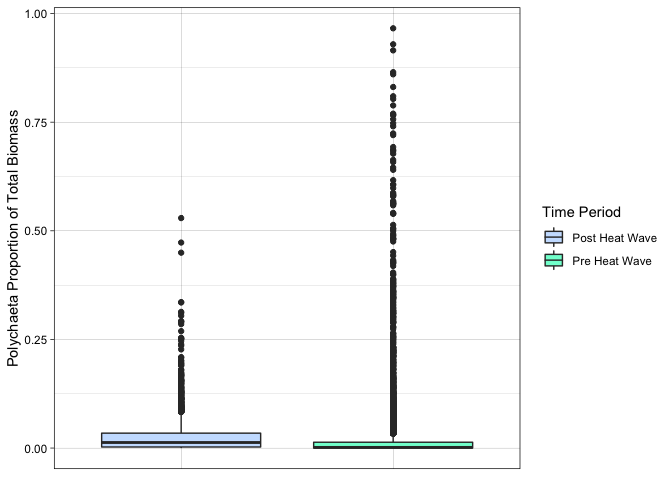

STAT545 Assignment B1
================
Julia Fast
01/11/2021

## Datset Background (Section Copied from STAT545A Mini Data Analysis Project)

The *zooplankton_biomass* dataset used for this assignment was acquired
courtesy of Fisheries and Oceans Canada (DFO). I will be using this
dataset for my MSc research project. It contains zooplankton biomass
data by major taxa collected from 1980 to 2018 at a variety of stations
in the NE Pacific and Canadian Arctic oceanic regions. Samples were
collected both during the day and at night using a variety of sampling
net types (Government of Canada \[date unknown\]).

## Install and Load Packages

**Install** `tidyverse`, `readr`, `roxygen2`, and `testthat` packages if
you have not already done so:

``` r
#install the tidyverse package:
#install.packages("tidyverse")

#install the readr package:
#install.packages("readr")

#install the roxygen2 package:
#install.packages("roxygen2")

#install the testthat package:
#install.packages("testthat")
```

**Load** the `tidyverse`, `testthat`, and `roxygen2` packages, as well
as the `zooplankton dataset` being used for this project:

*some of the below code from STAT545A Mini Data Analysis*

``` r
#load the tidyverse package
#load the readr package (this package will allow the CSV file containing the project dataset to be read)
library(readr) 
library(tidyverse)
library(testthat)
library(roxygen2)

#read the project dataset in RStudio, and save this dataset as a variable called "zooplankton_biomass"
#the CSV file containing the project dataset is located in the Milestone2 folder of the project GitHub repository
zooplankton_biomass <- read_csv('IOS_zooplankton_1980_2018_as_biomass_major_taxa_groups_EN.csv')
```

For this assignment, I’d like to use the function I will create to
answer questions pertaining to the zooplankton_biomass dataset from DFO.
I will use a cleaned up version of that I created for the Mini Data
Analysis Milestone 3 assignment from the STAT545A class.

``` r
#create a subset of the zooplankton_biomass dataset called "zooplankton_biomass_cleaned"
zooplankton_biomass_cleaned <- zooplankton_biomass %>% 
  #remove the columns from 'Station' to 'latitude' and from 'time' to 'CTD' from the dataset
  select(-c(Station:latitude, time:CTD)) %>% 
  #separate the date column into three columns of year, month, and day
  #the below line of code is from joels 2018
  separate(date, sep="-", into = c("year", "month", "day")) %>% 
  #remove newly created month and day columns from the dataset
  select(-c(month, day)) %>% 
  #create a new variable called "time_period" that groups each year as either pre or post marine heat wave
  mutate(time_period = case_when(year < 2014 ~ "Pre Heat Wave",
                                TRUE ~ "Post Heat Wave")) %>% 
  #arrange region_name to be in alphabetical order and year to be in ascending order
  arrange(across(region_name:year)) %>% 
  #arrange the columns so that the time_period column comes after the year column
  select(c(region_name, year, time_period, everything()))

#view the cleaned up dataset
print(zooplankton_biomass_cleaned)
```

    ## # A tibble: 11,621 × 38
    ##    region_name       year  time_period Polychaeta Amphipoda Cirripedia Cladocera
    ##    <chr>             <chr> <chr>            <dbl>     <dbl>      <dbl>     <dbl>
    ##  1 Alaska Basin East 1980  Pre Heat W…     1.32       0.123          0         0
    ##  2 Alaska Basin East 1980  Pre Heat W…     0.0233     0.513          0         0
    ##  3 Alaska Basin East 1980  Pre Heat W…     0          0              0         0
    ##  4 Alaska Basin East 1980  Pre Heat W…     0          0              0         0
    ##  5 Alaska Basin East 1980  Pre Heat W…     0.120      0              0         0
    ##  6 Alaska Basin East 1980  Pre Heat W…     0          0              0         0
    ##  7 Alaska Basin East 1980  Pre Heat W…     0          0              0         0
    ##  8 Alaska Basin East 1980  Pre Heat W…     0.120      0              0         0
    ##  9 Alaska Basin East 1980  Pre Heat W…     0          0.205          0         0
    ## 10 Alaska Basin East 1980  Pre Heat W…     0.120      0.421          0         0
    ## # … with 11,611 more rows, and 31 more variables: Copepoda <dbl>,
    ## #   Cumacea <dbl>, Anomura <dbl>, Brachyura <dbl>, Caridea <dbl>,
    ## #   Pleocyemata <dbl>, Euphausiacea <dbl>, Isopoda <dbl>, Mysida <dbl>,
    ## #   Ostracoda <dbl>, Bryozoa <dbl>, Chaetognatha <dbl>, Anthozoa <dbl>,
    ## #   Hydromedusa <dbl>, Siphonophora <dbl>, Scyphozoa <dbl>, Ctenophora <dbl>,
    ## #   Echinodermata <dbl>, Bivalva <dbl>, Cephalopoda <dbl>, Gastropoda <dbl>,
    ## #   Pteropoda <dbl>, Nemertea <dbl>, Phoronida <dbl>, Pisces <dbl>, …

I want to further modify this cleaned dataset to work best with the
function I plan to create:

``` r
#create a new dataset called "zooplankton_funct" from the cleaned version of the original dataset
zooplankton_funct <- zooplankton_biomass_cleaned %>% 
  #create a new column (variable) called "total_biomass" that sums all zooplankton taxa biomass values in each row
  mutate("total_biomass" = rowSums(across(where(is.numeric)))) %>%
  #divide the zooplankton biomass values by the total biomass in that sample so that these cells contain the proportion of total biomass the zooplankton taxa makes up in each sample
  #below line of code adapted from Cetinkaya-Rundel et al. 2020
  mutate(across(where(is.numeric), ~./total_biomass)) %>% 
  #remove the total biomass column
  select(-total_biomass) %>% 
  rename("Time Period" = time_period) %>% 
  # below code adapted from https://stackoverflow.com/questions/64188671/renaming-multiple-columns-with-dplyr-renameacross
  rename_with(~str_c(., " Proportion of Total Biomass"), Polychaeta:Animalia)
  


#view the new dataset
print(zooplankton_funct)
```

    ## # A tibble: 11,621 × 38
    ##    region_name       year  `Time Period` `Polychaeta Proport… `Amphipoda Propor…
    ##    <chr>             <chr> <chr>                        <dbl>              <dbl>
    ##  1 Alaska Basin East 1980  Pre Heat Wave             0.0161              0.00150
    ##  2 Alaska Basin East 1980  Pre Heat Wave             0.000787            0.0174 
    ##  3 Alaska Basin East 1980  Pre Heat Wave             0                   0      
    ##  4 Alaska Basin East 1980  Pre Heat Wave             0                   0      
    ##  5 Alaska Basin East 1980  Pre Heat Wave             0.00580             0      
    ##  6 Alaska Basin East 1980  Pre Heat Wave             0                   0      
    ##  7 Alaska Basin East 1980  Pre Heat Wave             0                   0      
    ##  8 Alaska Basin East 1980  Pre Heat Wave             0.00337             0      
    ##  9 Alaska Basin East 1980  Pre Heat Wave             0                   0.00720
    ## 10 Alaska Basin East 1980  Pre Heat Wave             0.00519             0.0183 
    ## # … with 11,611 more rows, and 33 more variables:
    ## #   Cirripedia Proportion of Total Biomass <dbl>,
    ## #   Cladocera Proportion of Total Biomass <dbl>,
    ## #   Copepoda Proportion of Total Biomass <dbl>,
    ## #   Cumacea Proportion of Total Biomass <dbl>,
    ## #   Anomura Proportion of Total Biomass <dbl>,
    ## #   Brachyura Proportion of Total Biomass <dbl>, …

# Exercises 1-3: Make a Function, Document the Function, Include Examples

I want to create a function that will allow me to compare the proportion
of total biomass made up by one of the zooplankton taxa pre and post
heat wave. I will make this function general so that it can be used to
compare any numeric variable across each category of any categorical
variable.

-   named variable x and y because of what axis, the categorical
    variable names would be on x axis and numeric variables on y axis
-   people are used to an x and y variable when creating plots

``` r
#' @title Multiple Boxplot for a Numeric Variable across Categories 
#' @description This function creates a multiple boxplot that shows the distribution of a numeric variable in different categories contained in a categorical variable. NA values will automatically be removed from the data, which will lead to the warning message "Removed n rows containing non-finite values (stat_boxplot)" with n being the number of NA rows removed.
#' @params dataframe The dataframe that contains the variables that you would like to use to create the boxplot. The class of this parameter must be dataframe.
#' @params x The categorical variable that we want to plot a numerical variable across. x must be a vector of class character or factor.
#' @params y The numeric variable that we want to examine the distribution of across a categorical variable. y must be a vector of class double, integer, or numeric.
#' @return A boxplot showing the distribution of y in each category contained in x
#' @examples 
#' # Create a boxplot using the "CO2" dataset from the r "datasets" package that shows the distribution of CO2 concentration of grass plants in each treatment type (chilled or nonchilled):
#' boxplot_numeric_category(CO2, Treatment, conc)
#' # Create a boxplot using the dplyr "starwars" dataset that shows the distribution of the height of starwars characters based on the sex of the characters:
#'starwars %>% boxplot_numeric_category(sex, height)
#' # Create a boxplot using the dplyr "starwars" dataset that attempts to plot the distribution of the name of starwars characters based on the sex of the characters.Because the name variable is a character and not a numeric vector, the function will deliver an error message.
#' starwars %>% boxplot_numeric_category(sex, name)
#' # Create a boxplot using the dplyr "storms" dataset that shows the distribution of the wind speeds observed for the storms Caroline and Doris:
#' boxplot_numeric_category((storms %>% filter(name == c("Amy", "Doris"))), name, wind)

#create a function called "boxplot_numeric_category"
boxplot_numeric_category <- function (dataframe, x, y) {
  
  #code modified from Kea Rutherford
  
  if(!is.data.frame(dataframe)) {
    stop('You have entered an input that is not a dataframe. Please use a dataframe for the dataframe input')
    }

  if(!(is.character(eval(substitute(x), dataframe)) || is.factor(eval(substitute(x), dataframe)))) {
    stop('You have entered a non-character or non-factor input. Please enter a character variable or factor variable for the x input')
  }
  
  if(!(is.numeric(eval(substitute(y), dataframe)) || is.integer(eval(substitute(y), dataframe)) || is.double(eval(substitute(y), dataframe)))) {
    stop('You have entered a non-numeric, non-integer, or non-double input. Please enter a variable of a numeric, integer, or double class for the y input')
  }
  
  ggplot(dataframe, aes({{ x }}, {{ y }})) + 
  geom_boxplot(aes(fill= {{ x }})) + 
    theme_linedraw() +
    #below line of code from Elferts 2016
    theme(axis.text.x=element_blank(),
          axis.ticks.x=element_blank(),
          axis.title.x=element_blank())
}

# remove na https://stackoverflow.com/questions/17216358/eliminating-nas-from-a-ggplot

# idea to include dataframe from Kea, Yulia directed me to her code and so is ||
```

Now let’s run this function see if it will create a boxplot that
compares Copepod biomass pre and post heat wave.

``` r
boxplot_cop_biomass <- boxplot_numeric_category(zooplankton_funct, `Time Period`, `Copepoda Proportion of Total Biomass`)

print(boxplot_cop_biomass)
```

<!-- -->

It appears to be working, but let’s run some tests to be sure!

# Exercise 4: Test the Function

First, let’s test to see if the three examples that have the right
variable types run without an error message and if the one example that
did not have all correct variable types gave an error message:

``` r
test_that("Testing if Examples for Boxplot Function Work or Do Not Work as Expected", {
  expect_silent(boxplot_numeric_category(CO2, Treatment, conc))
  expect_silent(starwars %>% boxplot_numeric_category(sex, height))
  expect_error(boxplot_numeric_category(starwars, sex, name), "You have entered a non-numeric, non-integer, or non-double input. Please enter a variable of a numeric, integer, or double class for the y input")
  expect_silent(boxplot_numeric_category((storms %>% filter(name == c("Amy", "Doris"))), name, wind))
})
```

    ## Test passed 🎊

Let’s test now to see if each of the examples that use the correct
variable types in the boxplot function output a ggplot (this is what we
would expect):

``` r
test_that("Output Class Type of Boxplot Function Examples is ggplot", {
  expect_s3_class((boxplot_numeric_category(CO2, Treatment, conc)), "ggplot")
  expect_s3_class((starwars %>% boxplot_numeric_category(sex, height)), "ggplot")
  expect_s3_class((boxplot_numeric_category((storms %>% filter(name == c("Amy", "Doris"))), name, wind)), "ggplot")
  })
```

    ## Test passed 🥳
