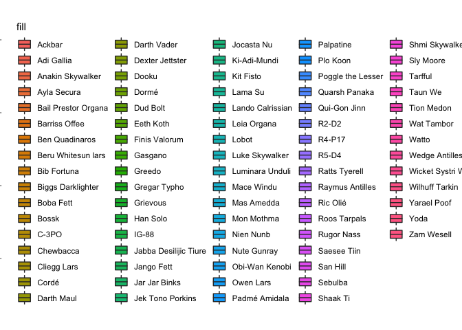

Assignment 1B
================
Julia Fast
01/11/2021

## Datset Background (Copied from Milestones 1 and 2)

The *zooplankton_biomass* dataset used for this project was acquired
courtesy of Fisheries and Oceans Canada (DFO). I will be using this
dataset for my MSc research project. It contains zooplankton biomass
data by major taxa collected from 1980 to 2018 at a variety of stations
in the NE Pacific and Canadian Arctic oceanic regions. Samples were
collected both during the day and at night using a variety of sampling
net types (Government of Canada \[date unknown\]).

# Install and Load Packages (Section taken from Milestone 2)

**Install** `tidyverse`, `readr`, and `roxygen2` packages if you have
not already done so:

``` r
#install the tidyverse package:
#install.packages("tidyverse")

#install the readr package:
#install.packages("readr")

#install the roxygen2 packages
#install.packages("roxygen2")
```

**Load** the `tidyverse` and `roxygen2` packages, as well as the
`zooplankton dataset` being used for this project:

``` r
#load the tidyverse package
#load the readr package (this package will allow the CSV file containing the project dataset to be read)
library(readr) 
library(tidyverse)
library(roxygen2)

#read the project dataset in RStudio, and save this dataset as a variable called "zooplankton_biomass"
#the CSV file containing the project dataset is located in the Milestone2 folder of the project GitHub repository
zooplankton_biomass <- read_csv('IOS_zooplankton_1980_2018_as_biomass_major_taxa_groups_EN.csv')
```

-   overall making a function that will compare the proportion of total
    zooplankton biomass made up by each zooplankton taxa pre and post HW

I want to use a cleaned up version of the zooplankton_biomass dataset
that I created for the Mini Data Analysis Milestone 3 assignment from
the STAT545A class.

``` r
#create a subset of the zooplankton_biomass dataset called "zooplankton_biomass_cleaned"
zooplankton_biomass_cleaned <- zooplankton_biomass %>% 
  #remove the columns from 'Station' to 'latitude' and from 'time' to 'CTD' from the dataset
  select(-c(Station:latitude, time:CTD)) %>% 
  #separate the date column into three columns of year, month, and day
  #the below line of code is from joels 2018
  separate(date, sep="-", into = c("year", "month", "day")) %>% 
  #remove newly created month and day columns from the dataset
  select(-c(month, day)) %>% 
  #create a new variable called "time_period" that groups each year as either pre or post marine heat wave
  mutate(time_period = case_when(year < 2014 ~ "Pre Heat Wave",
                                TRUE ~ "Post Heat Wave")) %>% 
  #arrange region_name to be in alphabetical order and year to be in ascending order
  arrange(across(region_name:year)) %>% 
  #arrange the columns so that the time_period column comes after the year column
  select(c(region_name, year, time_period, everything()))

#view the cleaned up dataset
print(zooplankton_biomass_cleaned)
```

    ## # A tibble: 11,621 × 38
    ##    region_name       year  time_period Polychaeta Amphipoda Cirripedia Cladocera
    ##    <chr>             <chr> <chr>            <dbl>     <dbl>      <dbl>     <dbl>
    ##  1 Alaska Basin East 1980  Pre Heat W…     1.32       0.123          0         0
    ##  2 Alaska Basin East 1980  Pre Heat W…     0.0233     0.513          0         0
    ##  3 Alaska Basin East 1980  Pre Heat W…     0          0              0         0
    ##  4 Alaska Basin East 1980  Pre Heat W…     0          0              0         0
    ##  5 Alaska Basin East 1980  Pre Heat W…     0.120      0              0         0
    ##  6 Alaska Basin East 1980  Pre Heat W…     0          0              0         0
    ##  7 Alaska Basin East 1980  Pre Heat W…     0          0              0         0
    ##  8 Alaska Basin East 1980  Pre Heat W…     0.120      0              0         0
    ##  9 Alaska Basin East 1980  Pre Heat W…     0          0.205          0         0
    ## 10 Alaska Basin East 1980  Pre Heat W…     0.120      0.421          0         0
    ## # … with 11,611 more rows, and 31 more variables: Copepoda <dbl>,
    ## #   Cumacea <dbl>, Anomura <dbl>, Brachyura <dbl>, Caridea <dbl>,
    ## #   Pleocyemata <dbl>, Euphausiacea <dbl>, Isopoda <dbl>, Mysida <dbl>,
    ## #   Ostracoda <dbl>, Bryozoa <dbl>, Chaetognatha <dbl>, Anthozoa <dbl>,
    ## #   Hydromedusa <dbl>, Siphonophora <dbl>, Scyphozoa <dbl>, Ctenophora <dbl>,
    ## #   Echinodermata <dbl>, Bivalva <dbl>, Cephalopoda <dbl>, Gastropoda <dbl>,
    ## #   Pteropoda <dbl>, Nemertea <dbl>, Phoronida <dbl>, Pisces <dbl>, …

``` r
#create a new dataset called "zooplankton_funct" from the cleaned version of the original dataset
zooplankton_funct <- zooplankton_biomass_cleaned %>% 
  #create a new column (variable) called "total_biomass" that sums all zooplankton taxa biomass values in each row
  mutate("total_biomass" = rowSums(across(where(is.numeric)))) %>%
  #divide the zooplankton biomass values by the total biomass in that sample so that these cells contain the proportion of total biomass the zooplankton taxa makes up in each sample
  #below line of code adapted from Cetinkaya-Rundel et al. 2020
  mutate(across(where(is.numeric), ~./total_biomass)) %>% 
  #remove the total biomass column
  select(-total_biomass) %>% 
  rename("Time Period" = time_period) %>% 
  # below code adapted from https://stackoverflow.com/questions/64188671/renaming-multiple-columns-with-dplyr-renameacross
  rename_with(~str_c(., " Proportion of Total Biomass"), Polychaeta:Animalia)
  


#view the new dataset
print(zooplankton_funct)
```

    ## # A tibble: 11,621 × 38
    ##    region_name       year  `Time Period` `Polychaeta Proport… `Amphipoda Propor…
    ##    <chr>             <chr> <chr>                        <dbl>              <dbl>
    ##  1 Alaska Basin East 1980  Pre Heat Wave             0.0161              0.00150
    ##  2 Alaska Basin East 1980  Pre Heat Wave             0.000787            0.0174 
    ##  3 Alaska Basin East 1980  Pre Heat Wave             0                   0      
    ##  4 Alaska Basin East 1980  Pre Heat Wave             0                   0      
    ##  5 Alaska Basin East 1980  Pre Heat Wave             0.00580             0      
    ##  6 Alaska Basin East 1980  Pre Heat Wave             0                   0      
    ##  7 Alaska Basin East 1980  Pre Heat Wave             0                   0      
    ##  8 Alaska Basin East 1980  Pre Heat Wave             0.00337             0      
    ##  9 Alaska Basin East 1980  Pre Heat Wave             0                   0.00720
    ## 10 Alaska Basin East 1980  Pre Heat Wave             0.00519             0.0183 
    ## # … with 11,611 more rows, and 33 more variables:
    ## #   Cirripedia Proportion of Total Biomass <dbl>,
    ## #   Cladocera Proportion of Total Biomass <dbl>,
    ## #   Copepoda Proportion of Total Biomass <dbl>,
    ## #   Cumacea Proportion of Total Biomass <dbl>,
    ## #   Anomura Proportion of Total Biomass <dbl>,
    ## #   Brachyura Proportion of Total Biomass <dbl>, …

# Exercise 1: Make a Function (25 points)

In this exercise, you’ll be making a function and fortifying it. The
function need not be complicated. The function need not be “serious”,
but shouldn’t be nonsense.

I want to create a function that compares the proportion of total
biomass made up by one of the zooplankton taxa pre and post heat wave.

No NAs in data.

``` r
#https://discuss.analyticsvidhya.com/t/how-can-i-check-whether-my-data-frame-contains-na-inf-values-in-some-column-or-not-in-r/1647
any(is.na(zooplankton_funct))
```

    ## [1] FALSE

``` r
' @title Boxplot '
```

    ## [1] " @title Boxplot "

``` r
#create a function called "boxplot_zoop"
boxplot_zoop <- function (data, x, y) {
    ggplot(data, aes({{ x }}, {{ y }})) + 
  #specify a box plot, set the width of the boxes, and specify the transparency of the box plot
  geom_boxplot(aes(fill= {{ x }})) + 
    #change the theme of the plot
    theme_linedraw() +
    #change the colours of each box
    #the below line of code is from STHDA [date unknown]
    scale_fill_manual(values=c("lightsteelblue1", "aquamarine1", "lightsalmon1")) +
    #remove the x axis ticks and labels
    #below line of code from Elferts 2016
    theme(axis.text.x=element_blank(),
          axis.ticks.x=element_blank(),
          axis.title.x=element_blank())
}
```

Now let’s test this function to see if it works by creating a boxplot
that compares Copepod biomass pre and pst heat wave.

``` r
boxplot_zoop(zooplankton_funct, `Time Period`, `Copepoda Proportion of Total Biomass`)
```

<!-- -->

# Exercise 2: Document your Function (20 points)

In the same code chunk where you made your function, document the
function using roxygen2 tags. Be sure to include:

Title. Function description: In 1-2 brief sentences, describe what the
function does. Document each argument with the @param tag, making sure
to justify why you named the parameter as you did. (Justification for
naming is not often needed, but we want to hear your reasoning.) What
the function returns, using the @return tag.

Before getting started, let’s also modify the region_name column in the
zooplankton_biomass_mi3 (cleaned) dataset and convert this variable from
a character object to a factor.

``` r
#convert the region_name variable from a character object to a factor
#below line of code from Schork [date unknown]
#zooplankton_biomass_mi3$region_name <- as.factor(zooplankton_biomass_mi3$region_name)
```

below line of code from
<https://stackoverflow.com/questions/49943092/how-to-set-ggplot-x-label-equal-to-variable-name-during-lapply>

get_name \<- deparse(substitute(y))

xlab(label= get_name)

possible sources  
<https://subscription.packtpub.com/book/big_data_and_business_intelligence/9781783554553/1/ch01lvl1sec12/passing-parameter-values-to-titles-and-labels>
